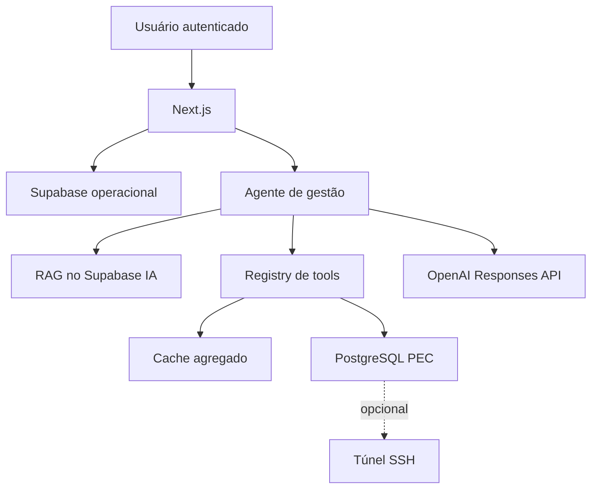
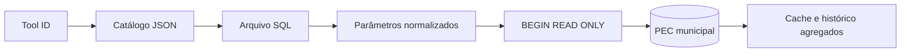

# Arquitetura

## Visão geral



O núcleo conversacional está no Next.js. O n8n presente em `n8n/` é legado/experimental e não participa do fluxo web em produção.

## Fluxo da interface

1. O login cria o cookie HTTP-only `cbai_access_token`.
2. `requireManagementIdentity()` resolve usuário, organização, município, papel e acesso nominal.
3. O cookie `cbai_municipality_id` mantém o município ativo.
4. A interface chama `/api/chat` ou uma rota `/api/tools/{toolId}`.
5. O backend sempre obtém o município da sessão, nunca do prompt.

## Fluxo do agente

1. Recupera evidências normativas com `retrieveKnowledge()`.
2. Envia pergunta, histórico curto, evidências e tools à Responses API.
3. Executa chamadas homologadas por `tool-registry.ts`.
4. Permite chamadas paralelas para análises amplas.
5. Reenvia resultados ao modelo para síntese.
6. Retorna texto, fontes e apresentação tabular/gráfica.

## Fluxo de dados PEC



Para conexão direta, há um pool por município. Para SSH, é aberto um encaminhamento por execução e um `pg.Client` usa o canal como stream.

## Diretórios

```text
app/                         interface e rotas API
config/                      catálogo de tools e metadados dos indicadores
docs/                        documentação técnica
lib/                         domínio, integrações e segurança
prompts/                     prompts auxiliares/legados
sql/tools/                   consultas PEC versionadas
supabase/operational/        migrations do Supabase operacional
.github/workflows/           build, imagem e cache diário
n8n/                         integração experimental, fora do núcleo web
```

## Responsabilidades principais

| Arquivo | Responsabilidade |
|---|---|
| `lib/auth.ts` | sessão, identidade e municípios autorizados |
| `lib/agent.ts` | RAG, function calling e síntese |
| `lib/tool-registry.ts` | allowlist, parâmetros, RBAC, cache e execução |
| `lib/dynamic-aggregate.ts` | fallback SQL agregado com validação rígida |
| `lib/pec.ts` | transações somente leitura, pool e timeout |
| `lib/pec-connections.ts` | armazenamento criptografado e teste de conexão |
| `lib/ssh-tunnel.ts` | túnel, timeout e fingerprint SSH |
| `lib/tool-cache.ts` | cache de 26 horas e snapshots diários |
| `lib/cache-refresh.ts` | varredura de ferramentas agregadas por município |
| `lib/pec-validator.ts` | validação estrutural das SQLs homologadas |
| `lib/rag.ts` | embeddings e recuperação normativa |

## Decisões arquiteturais

- Regras de indicador ficam em SQL versionado, não no LLM.
- Credenciais nunca chegam ao navegador ou ao modelo.
- Dados nominais não entram no cache nem no histórico.
- O Supabase operacional e o Supabase de IA são projetos distintos.
- O healthcheck verifica apenas a aplicação, evitando reinício por falha transitória externa.
